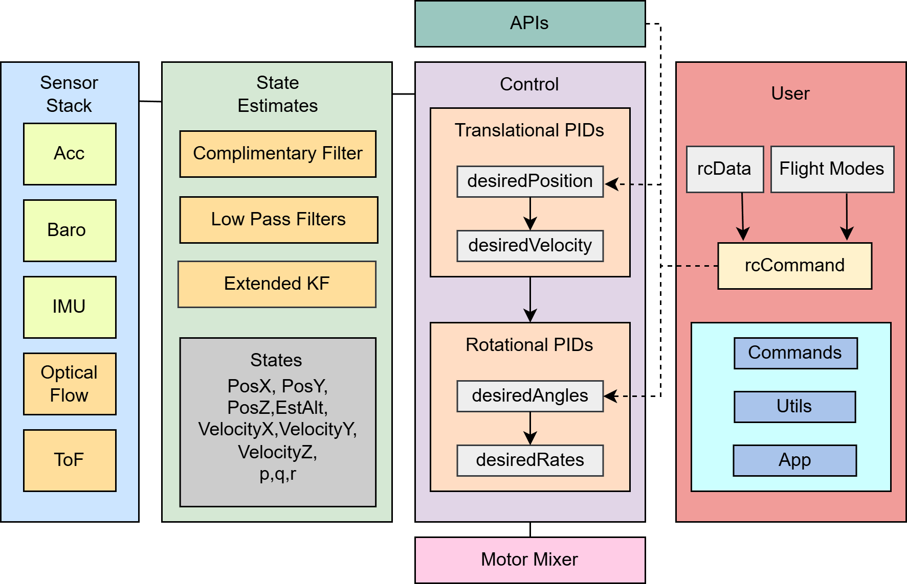

# Control System for Drone Stabilization and Precision Motion

**Inter IIT Tech Meet 14.0 - Low Prep Problem Statement**  
**Organization:** Drona Aviation  
🥉 **Bronze Medal** - Team 65

---

> ⚠️ **Note:** Source code and detailed technical report are not included in this repository due to intellectual property and firmware ownership considerations. This repository serves as a showcase of the brief overall system design, methodology, and results.

## Overview

Indoor nano-UAVs operate in GPS-denied environments where stable flight depends entirely on onboard sensing and estimation. The objective of this project was to design and implement a complete onboard estimation and control pipeline capable of:

- Autonomous takeoff and hover
- Stable position holding without external localization systems
- Precision micro-movements using RC commands
- Robust operation under sensor noise and degradation

The system was developed using onboard sensing from Optical Flow, IMU, Time-of-Flight (ToF), and Barometer measurements.

---

## Problem Statement

The official Inter IIT Tech Meet 14.0 problem statement provided by Drona Aviation:

[📄 View the Official Problem Statement PDF](./docs/problem_statement.pdf)

---

## System Architecture

The overall system architecture is shown below:



The overall architecture consisted of four major layers:

### Sensor Stack

- PAW3903 Optical Flow Sensor
- ICM-20948 IMU
- VL53L1X Time-of-Flight Sensor
- ICP-10111 Barometer

### State Estimation

Sensor measurements were processed through:

- Complementary Filters
- Low-Pass Filters
- Extended Kalman Filter (EKF)

Estimated states included:

- Horizontal Position
- Horizontal Velocity
- Estimated Altitude
- Vertical Velocity
- Angular Rates

### Control Layer

A cascaded control architecture was implemented:

```text
Position Controller
        ↓
Velocity Controller
        ↓
Attitude Controller
        ↓
Motor Mixer
```

This architecture converts position targets into velocity commands, velocity commands into attitude targets, and finally motor actuation commands.

### User Interface Layer

Pilot inputs and flight modes were mapped into motion commands and position-hold behavior through the onboard control pipeline.

---

## Sensor Fusion

### Optical Flow + IMU Fusion

The optical flow sensor was used to estimate planar motion while inertial measurements provided short-term motion prediction.

An Extended Kalman Filter was developed to fuse:

- Optical flow measurements
- IMU acceleration data
- Altitude estimates

The EKF estimated:

- Horizontal position
- Horizontal velocity
- Accelerometer bias

The estimator dynamically adjusted its reliance on optical flow measurements based on surface quality, increasing dependence on inertial measurements when optical flow quality degraded.

### Altitude Estimation

Altitude estimation combined and dynamically selected the most reliable sensor source:
- Time-of-Flight measurements (Primary up to ~2 m; operational window: 0–350 cm)
- Barometer measurements (Fallback as ToF quality degrades)
- IMU acceleration
- Filtering and fusion techniques used for smoothing and bias correction

Filtering methods included:
- 3rd Order Complementary Filter
- Kalman Filtering
- Exponential Moving Average Filtering
- Tilt Compensation

---

## Control Architecture

The control system was adapted for onboard localization using optical-flow-based state estimates.

Key features included:

- Position Hold using onboard state estimation
- Velocity control using estimated horizontal motion
- Cascaded Position → Velocity → Attitude control loops
- Autonomous stabilization after movement commands

---

## Precision Micro-Movement Mode

A discrete motion mode was implemented where RC stick inputs act as displacement triggers rather than continuous velocity commands.

Features:

- Deadband-based movement detection
- Fixed displacement target of 15 cm
- Autonomous execution of commanded motion
- Automatic re-stabilization at the new setpoint
- Protection against repeated triggering while sticks remain deflected

---

## Failure Handling

The system incorporated fallback logic for sensor degradation.

### Optical Flow Degradation

- Surface quality monitoring
- Reduced reliance on optical flow measurements
- IMU-assisted stabilization

### ToF Degradation

- Automatic transition to barometer-dominant altitude estimation
- Continued altitude correction using inertial measurements

### Sensor Transients

- Noise rejection through filtering and temporal consistency checks
- Prevention of high-frequency disturbances entering the control loop

---
## Results & Hover Performance

The developed pipeline successfully achieved its baseline design goals, though experimental testing highlighted key characteristics of the hardware integration:

- **Autonomous Stability:** The system successfully demonstrated autonomous takeoff and short-term stable hover.
- **Long-Term Drift & Transparency:** Even though the drone successfully attempts to stabilize and hover, it begins to experience spatial drift after some time. This drift could have been easily masked or covered up using pilot TRIM configurations, but leaving it un-trimmed was intentionally chosen to accurately display the true, raw result of integrating the Optical Flow sensor with the ToF sensor.
- **Fault Tolerance:** Real-time software fallback routines successfully managed intentional or environmental sensor degradation, shifting reliance between inertial data and opticflow tracking based on surface quality metrics.

---
## Acknowledgements

- Inter IIT Tech Meet 14.0
- Drona Aviation for designing and organizing the problem statement

---
## Team 65
**IIT (BHU) Varanasi**  
